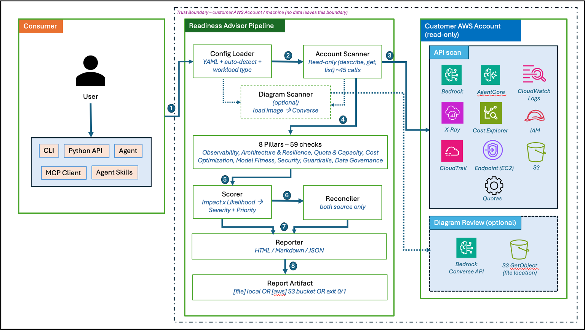
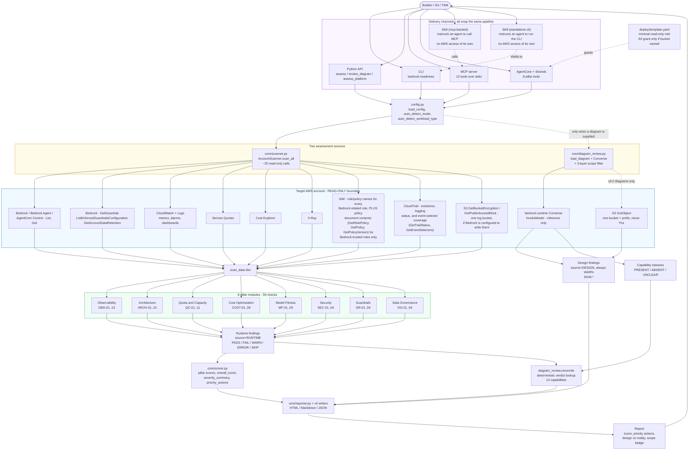
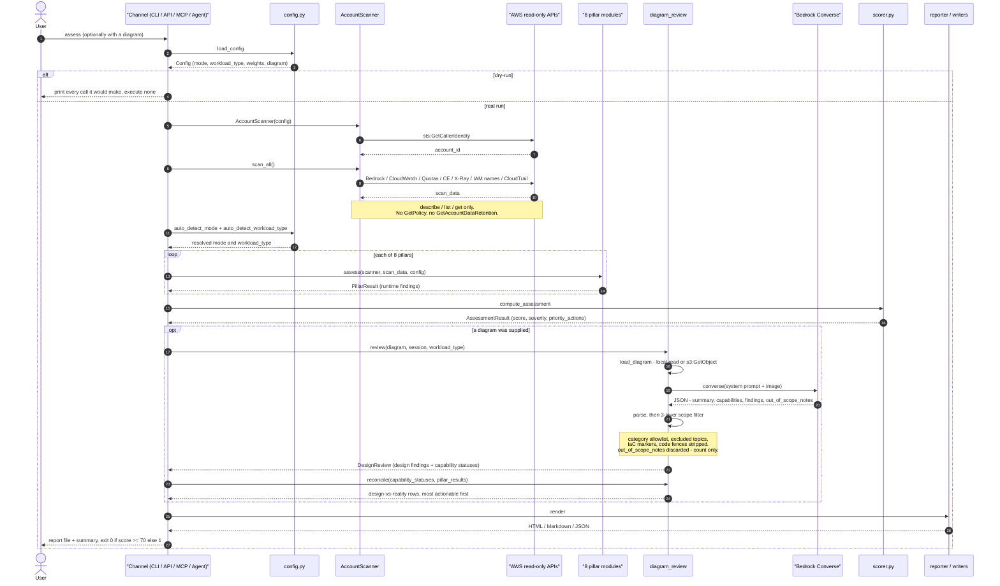
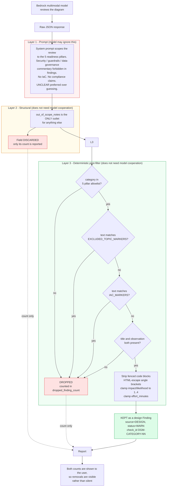

# Architecture and Workflow -- Bedrock Readiness (readiness-only)

How this package is put together, how a request flows through it, and where the
scope and read-only boundaries are enforced in code.

> **Sample content -- not for production use without additional security
> testing.** Provided as is, with no warranty of workmanship or fitness for
> purpose, and no claim of compliance with any regulation or standard.

- [At a glance](#at-a-glance)
- [Component architecture](#component-architecture)
- [Workflow: end-to-end request](#workflow-end-to-end-request)
- [Scope enforcement](#scope-enforcement)
- [Diagram-review model selection](#diagram-review-model-selection)
- [Design vs. reality reconciliation](#design-vs-reality-reconciliation)
- [User journeys](#user-journeys)
- [Module reference](#module-reference)
- [Documentation references](#documentation-references)
- [Permission surface](#permission-surface)
- [Boundaries that are structural, not conventional](#boundaries-that-are-structural-not-conventional)

## At a glance

| | |
|---|---|
| **Question it answers** | Is this Bedrock deployment *operationally* ready for production, and what do I fix first? |
| **Pillars** | 8 -- Observability, Architecture & Resilience, Quota & Capacity, Cost Optimization, Model Fitness, Security, Guardrails, Data Governance |
| **Checks** | 59 (`OBS-01..13`, `ARCH-01..10`, `QC-01..11`, `COST-01..09`, `MF-01..04`, `SEC-01..04`, `GR-01..04`, `DG-01..04`) |
| **Assessment sources** | Live account scan (all 8 pillars), architecture diagram review (5 pillars, see below), or both |
| **Delivery channels** | CLI, Python API, MCP server, AgentCore/Strands agent, and two Agent Skills (`skill/mcp-backed/` wraps the MCP server, `skill/standalone-cli/` shells out to the CLI) |
| **Output formats** | HTML, Markdown, JSON |
| **Mutations** | None. Every call is describe/list/get, plus `bedrock:InvokeModel` and `s3:GetObject` for diagrams |
| **No deployable remediation** | Every recommendation, including Security/Guardrails/Data Governance, is plain-text guidance pointing at public AWS documentation -- never a corrected IAM policy, guardrail configuration, or template |
| **Diagram review is narrower** | Covers Observability, Architecture, Quota & Capacity, Cost Optimization, and Model Fitness only -- a vision model reading a picture is a less verifiable source for security-adjacent claims than the account scan's deterministic API reads. See "Diagram review scope" below |

## Component architecture

The customer-facing view — five delivery channels wrapping one read-only
pipeline that scans a target AWS account and (optionally) reviews an
architecture diagram in the customer's own account and region:



**How it works:**

1. A user invokes the assessment through one of five delivery channels (CLI,
   Python API, MCP client, AgentCore-hosted Strands agent, or Agent Skill)
   using their own AWS credentials.
2. The **Config Loader** reads the optional YAML + CLI overrides and
   auto-detects `mode` (pre-production vs production) and `workload_type`
   from the environment.
3. The **Account Scanner** makes ~45 read-only `Describe` / `List` / `Get`
   calls across Bedrock, Bedrock AgentCore, CloudWatch, X-Ray, Service
   Quotas, Cost Explorer, IAM, CloudTrail, EC2 (VPC endpoints), and one
   targeted S3 read on the Bedrock invocation-logging bucket if configured.
   *(Optional)* The **Diagram Scanner** loads a diagram (local path or
   `s3://…`) and calls Amazon Bedrock Converse in the customer's own
   account and region.
4. The **8 pillars** evaluate the scan data across 59 checks.
5. The **Scorer** computes per-finding risk (Impact × Likelihood), assigns
   severity bands, and ranks Priority Actions.
6. *(Both sources present)* The **Reconciler** produces a design-vs-reality
   table across 14 readiness capabilities.
7. The **Reporter** renders the output as HTML (default), Markdown, or JSON.
8. **The report is written locally or to the customer's own S3 bucket** —
   never to a tool-owned endpoint. Exit code `0` (score ≥ 70) or `1` is the
   CI/CD gate.

The engineering view below shows the same pipeline in more detail, including
the internal seams — the split between runtime and design findings, how the
scan_data dict flows through the pillar modules, and how the reconciler
consumes both:



Three things this diagram is meant to make obvious:

1. **All channels converge on one pipeline.** There is no channel-specific
   assessment logic, so a finding is identical whether it arrives via CLI,
   Python, MCP, the agent, or either skill track (both of which are themselves
   just clients of an existing channel -- MCP or CLI). Adding a channel cannot
   widen scope.
2. **The runtime score and the design findings never mix.** Only runtime
   findings reach `scorer.py`. Design findings bypass scoring and go straight
   to the reporter, because a model's reading of a picture is not evidence
   about a live account.
3. **There is no path from the pipeline back into the account.** Every arrow
   into the AWS box is a read. Nothing returns to mutate state, and no
   deployable remediation artefact is produced at any stage.

## Workflow: end-to-end request




Notable ordering constraints:

- **Auto-detection runs after the scan, before the pillars.** Check
  applicability depends on the resolved `workload_type` (for example `QC-11`
  CRIS detection only runs for chatbot and multi-agent workloads), and that
  type is inferred from the resources actually found.
- **`--dry-run` short-circuits before any AWS call**, including
  `sts:GetCallerIdentity`. It is the fastest way to demonstrate the read-only
  claim to a security reviewer.
- **The exit code is the CI/CD contract**: `0` when `overall_score >= 70`,
  else `1`. `is_production_ready()` wraps the same threshold.

## Scope enforcement

The diagram review asks a model to critique an architecture. A model asked to
do that will volunteer security advice unless actively stopped, and this
solution deliberately does not produce prescriptive security guidance from a
vision model reading a picture. Scope is therefore enforced in three layers,
and **layers 2 and 3 do not depend on the model complying with layer 1**.




The excluded-topic list covers identity and access, credentials, encryption and
key management, network isolation and perimeter, guardrails and content safety,
regulated data and audit, and threat/vulnerability framing. It deliberately
omits words that legitimately appear in readiness findings -- "policy" as in
retry or scaling policy, "throttle", "isolation" as in session isolation -- to
avoid over-filtering real signal.

`tests/run_diagram_review.py` feeds the pipeline a deliberately misbehaving
model response containing security findings, a guardrails finding, an IAM
finding, both fenced and unfenced CloudFormation, out-of-range risk numbers, an
unknown capability key and a malformed finding. It asserts all of them are
handled and that no forbidden term survives into any output format.

## Diagram-review model selection

There is **no hardcoded default model**. Assuming access to a specific model is
the fastest way to make a tool fail on a customer account, so the model is
derived from the same scan the assessment already ran.

```
ListFoundationModels ──filter inputModalities contains IMAGE──> capable[]
                                                                  │
                                    cheapest by MODEL_COST_PREFERENCE
                                    (unknown models rank last)
                                                                  │
                                                               chosen
                                                                  │
ListInferenceProfiles ──profile covering `chosen`?──> global. > us./eu./apac. > direct
                                                                  │
                                                          ModelChoice(invoke_id, base_id, via)
```

Selection lives in `select_diagram_model()` and needs only the two lists the
scan already collects, so `assess --diagram` spends **no extra API calls**. The
diagram-only path makes two (`ListFoundationModels`, `ListInferenceProfiles`).

An explicit `--diagram-model-id` is used verbatim with no capability check --
the caller is assumed to know their own account.

Cost ranking is a static preference order, not live pricing. The Price List API
would need `pricing:GetProducts`, a permission this tool otherwise has no use
for, and would add a network dependency to model selection. The tradeoff is
that the list needs occasional maintenance as models are released.

### Skip, never retry

| Condition | Outcome |
|-----------|---------|
| No image-capable model available | `DiagramReviewSkipped` before the diagram is read |
| Invoke fails (access denied, wrong region, throttled, expired credentials) | `DiagramReviewSkipped` with a classified reason, one attempt only |
| Response unparseable | `DiagramReviewSkipped` -- not something the customer can fix |
| Diagram path/format/size bad | `DiagramReviewError` -- caller input, surfaced loudly |

`botocore` retries are explicitly disabled on the bedrock-runtime client
(`max_attempts=1`). Without that, the SDK would retry three times with backoff,
which is the wrong behaviour for an optional review.

A skip never costs the caller their scan: `assess --diagram` records
`diagram_skipped_reason` and returns the full assessment, and the report renders
a "Diagram review not performed" section so the omission is visible rather than
silent. `review-diagram` has nothing else to produce, so it prints the reason and
exits 1.

## Design vs. reality reconciliation

When both a scan and a diagram are available, the two are compared per
readiness capability. This is the highest-value output of the combined mode:
**capabilities the diagram promises that the account does not actually have.**

The split of responsibility matters. The model only answers PRESENT / ABSENT /
UNCLEAR for each of the 14 capabilities in `READINESS_CAPABILITIES`. The account
column comes entirely from real check results. The verdict is a table lookup on
the pair -- the model never decides a verdict.

| Verdict | Diagram | Account | Meaning |
|---------|:-------:|:-------:|---------|
| `DESIGN_NOT_IMPLEMENTED` | PRESENT | ABSENT | Diagram shows it, account does not have it |
| `MISSING_IN_BOTH` | ABSENT | ABSENT | Neither the design nor the account has it |
| `ABSENT_IN_ACCOUNT` | UNCLEAR | ABSENT | Account does not have it; the diagram was unclear either way |
| `UNDOCUMENTED_IN_DESIGN` | ABSENT/UNCLEAR | PRESENT | Account has it, diagram does not show it |
| `ALIGNED` | PRESENT | PRESENT | Both have it |
| `INCONCLUSIVE` | any | not assessed | The scan could not determine it, so no comparison is possible |

Rows sort by that order, most actionable first, then by runtime severity.

`INCONCLUSIVE` means the *scan* could not determine the state -- not that the
diagram was vague. A gap the scan proves is reported as `ABSENT_IN_ACCOUNT` even
when the diagram says nothing about it, so a real high-severity gap is never
hidden behind a label that reads as "nothing to see here".

Each capability maps to the specific runtime check IDs that verify it, and those
IDs are cited on the row, so any verdict can be traced back to the check that
produced it. Every capability belongs to Observability, Architecture, Quota &
Capacity, Cost Optimization, or Model Fitness -- deliberately **not** Security,
Guardrails, or Data Governance, even though the account scan now assesses all
three. That is a diagram-review-specific boundary: a vision model reading a
picture is a less verifiable source for security-adjacent claims than a live
API read, so this reconciliation table was not extended to cover them. See
"Diagram review scope" above.

## User journeys

### A. Pre-launch readiness gate (CLI, most common)

```bash
bedrock-readiness init                                   # starter config
bedrock-readiness assess --dry-run                       # show calls, execute none
bedrock-readiness assess --region us-east-1 --format html
```

Read the score, work the Priority Actions table top-down (it is risk-ranked and
dependency-ordered), re-run. Wire the exit code into a pipeline stage to block a
launch below 70.

### B. Design review before infrastructure exists

```bash
bedrock-readiness review-diagram --diagram <your-diagram>.png
```

No account is scanned and no score is produced. Output is a set of advisory
design findings plus the model's read of the architecture. Useful in a design
review meeting, where the account does not exist yet.

### C. Drift check on an existing deployment

```bash
bedrock-readiness assess --region us-east-1 --diagram <your-diagram>.png
```

Produces the normal scored report *plus* the design-vs-reality table. The
`DESIGN_NOT_IMPLEMENTED` rows are the ones to act on: the architecture diagram
in the wiki says one thing, the account says another.

### D. Conversational, in the editor (MCP)

```json
{
  "mcpServers": {
    "bedrock-readiness": {
      "command": "bedrock-readiness-mcp",
      "env": { "AWS_PROFILE": "your-profile", "AWS_REGION": "us-east-1" }
    }
  }
}
```

Then ask directly: *"Is my Bedrock deployment ready for production?"*, *"Check
just the quota headroom in us-west-2"*, *"What does this tool actually check,
and what does it not?"*

13 tools: one per pillar (`check_observability` ... `check_data_governance`,
8 in total), plus `assess_bedrock_readiness`, `review_architecture_diagram`,
`assess_bedrock_platform`, `list_readiness_checks`, and `describe_scope`.

Two MCP-specific design decisions:

- **No `check_pillar(pillar="...")` free-text tool.** Each pillar gets its own
  generated tool, so a client cannot name a pillar that should not exist and
  learn something from how the call fails.
- **A scan is reused for up to 5 minutes** across tool calls in one session. An
  LLM will often invoke several pillar tools in a single turn; without this,
  each would re-run roughly 20 API calls. Reuse age is always reported, and
  `force_refresh=true` overrides -- a stale read is visible, never silent.

`describe_scope` exists so the model itself can answer scope questions
accurately rather than guessing -- including that the account scan covers all
eight pillars while the diagram review covers five, and that no pillar's
recommendations are ever a deployable artifact.

### E. CI/CD gate (Python API)

```python
from bedrock_readiness import is_production_ready

if not is_production_ready(region="us-east-1", threshold=70):
    raise SystemExit("Bedrock readiness below threshold")
```

## Module reference

```
bedrock_readiness/
├── __init__.py            Public API surface (5 exports)
├── cli.py                 assess | review-diagram | checks | mcp | init
├── api.py                 assess / assess_pillar / review_diagram /
│                          assess_platform / is_production_ready
├── config.py              YAML loading + workload/mode auto-detection
├── core/
│   ├── models.py          Finding, PillarResult, AssessmentResult, Config,
│   │                      READINESS_CAPABILITIES, RECONCILIATION_VERDICTS,
│   │                      DEFAULT_WEIGHTS per workload type
│   ├── scanner.py         AccountScanner -- all read-only AWS calls
│   ├── diagram_review.py  Diagram loading, Converse call, scope filter,
│   │                      reconciliation
│   ├── references.py      Curated AWS doc links per check + scope validator
│   ├── scorer.py          Pillar/overall scores, risk ranking, severity summary
│   └── reporter.py        HTML report generation
├── modules/
│   ├── __init__.py        PILLAR_MODULES, PILLAR_NAMES, CHECK_CATALOG
│   ├── observability.py   OBS-01..13
│   ├── architecture.py    ARCH-01..10
│   ├── quota_capacity.py  QC-01..11
│   ├── cost_optimization.py  COST-01..09
│   ├── model_fitness.py   MF-01..04
│   ├── security.py        SEC-01..04
│   ├── guardrails.py      GR-01..04
│   └── data_governance.py DG-01..04
└── delivery/
    ├── agentcore_agent.py Strands Agent on AgentCore Runtime
    └── mcp_server.py      MCP server, 13 tools

skill/
├── README.md              Decision guide (which track to use) + shared setup
├── guardrails.md          Rules both tracks must follow -- extracted here so
│                          the two SKILL.md files reference one source, not
│                          two copies that could drift
├── mcp-backed/
│   └── SKILL.md           Agent Skills spec file; tells the agent to call
│                          the MCP server's tools
└── standalone-cli/
    └── SKILL.md           Agent Skills spec file; tells the agent to run
                            `bedrock-readiness` in its own shell

deploy/template.yaml       AgentCore Runtime + minimal read-only IAM role
tests/
├── fixtures/*.json        3 account fixtures (no credentials needed)
├── run_fixtures.py        Pipeline against fixtures, optional HTML
├── run_diagram_review.py  Diagram pipeline + scope filter (stubbed model)
├── test_check_catalog.py  Catalog drift guard + coverage report
├── test_references.py     Doc-link scope rules + no-model-injected-links guard
├── test_readonly_surface.py  Read-only guarantee, derived from source
├── test_no_deployable_remediation.py  No IaC/policy artifact in any finding
├── test_fail_open_guards.py  A partial-failure read never reports a clean PASS
└── test_skill_integrity.py   Skill files' tool/subcommand mentions match the code
```

There are no pre-generated sample reports in this repository, and nothing is
seeded with placeholder accounts, models, or diagram paths. Reports come from a
real scan of the caller's own account; the fixtures under `tests/fixtures/` exist
to exercise the pipeline offline and are never used to produce shipped output.

`CHECK_CATALOG` in `modules/__init__.py` is the single declarative source for
"what does this tool check?", consumed by both `bedrock-readiness checks` and
the MCP `list_readiness_checks` tool. The pre-split platform's MCP server
hardcoded its own table and it drifted from what the code actually
implemented at the time -- missing `QC-11`, `COST-08/09`, and the entire
Model Fitness pillar. `tests/test_check_catalog.py` asserts the catalog
matches the check IDs the pillar modules actually emit, so it cannot go
stale silently -- true now for all 59 checks across all 8 pillars,
including Security, Guardrails, and Data Governance.

## Documentation references

Each finding pairs its one-line recommendation with 1-2 links to the official
AWS page that documents the change -- 42 unique URLs covering all 59 checks,
defined in `core/references.py`.

This is deliberately *reference* content, not remediation. The tool says what to
change and where AWS documents it; it never ships something to apply. That
distinction is what keeps it clear of the "solutions which fix existing issues
in customer environments" escalation trigger.

**Links can only come from the static map.** Two structural properties, both
asserted in `tests/test_references.py`:

- `Finding` has no URL-carrying field. A pillar module cannot attach a link even
  by accident, and the diagram-review model has nowhere to put one -- its output
  is parsed into `Finding` objects.
- Renderers call `references.for_check(check_id)` at render time, keyed on an ID
  the code itself generated. An unmapped, unknown, or invented ID returns
  nothing rather than a guess.

That matters because a model asked for documentation links will hallucinate
plausible URLs, and may reach for a security page when a finding sits next to
one. Neither is possible if links cannot originate from model output. The MCP
server additionally instructs the client model to pass links through as given
and not to add its own.

**Scope rules on the link set itself**, enforced by `references.validate()`:

| Rule | Why |
|------|-----|
| HTTPS only | Baseline |
| AWS-owned hosts only (`docs.aws.amazon.com`, `aws.amazon.com`) | A recommendation should never point a reader at third-party guidance for how to configure an AWS service -- so no third-party blogs, however good |
| Security/identity/encryption/guardrails/data-governance pages are restricted to the Security, Guardrails, and Data Governance checks | Linking one to an Observability or Cost check would reintroduce, by reference, guidance those pillars don't cover. Attached to a Security/Guardrails/Data-Governance check, it's simply that check's own documentation. `RESTRICTED_TOPIC_PILLARS` in `core/references.py` names the three pillars this applies to. |
| No compliance or regulated-data pages, and no title implying a compliance outcome -- for ANY pillar, no exception | Avoids the "claims to fix customer compliance problems" trigger. Explaining an audit-logging or encryption *mechanism* is in scope; asserting a *compliance conclusion* never is |
| Every key must be a check this package implements | Prevents orphan entries for checks that don't exist |

The test also runs every OBS/ARCH/QC/COST/MF reference's title and URL through
the same `EXCLUDED_TOPIC_MARKERS` list the diagram-review filter uses -- Security/
Guardrails/Data Governance references are exempt from that specific check, since
mentioning those topics accurately is the entire point of their references.

Live URL reachability is not asserted in the suite, to keep it free of a network
dependency. All 42 URLs were checked against public AWS documentation when
added; re-verify with a link checker before publishing.

## Permission surface

The API surface is **declared in code, next to the calls**, in
`core/scanner.py`:

| Declaration | Meaning |
|-------------|---------|
| `READ_ONLY_OPERATIONS` | Performed by every scan |
| `CONDITIONAL_OPERATIONS` | Only with `--role-arn`, or when reviewing a diagram |
| `NEVER_CALLED_OPERATIONS` | Deliberately absent, with the capability each would expose |

`--dry-run` renders those tuples rather than a separately maintained list, so the
output cannot drift from behaviour:

```bash
bedrock-readiness assess --dry-run
```

Roughly: `describe` / `list` / `get` across Bedrock, Bedrock Agent, AgentCore
Control, CloudWatch, Logs, EC2, Service Quotas, Cost Explorer, and X-Ray. IAM
role and policy names are read for every Bedrock-related role; policy document
*contents* (`GetRolePolicy` / `GetPolicy` / `GetPolicyVersion`) are read only
for roles already identified as trusted by a Bedrock service principal.
CloudTrail existence, logging status, and event-selector coverage
(`GetTrailStatus` / `GetEventSelectors`) are read for every trail found.
Guardrail configuration and account-wide data-retention posture
(`GetGuardrail`, `ListEnforcedGuardrailsConfiguration`, `GetAccountDataRetention`)
are read for the Guardrails and Data Governance pillars. `GetBucketEncryption` /
`GetPublicAccessBlock` are read only for the one S3 bucket, if any, configured
as the Bedrock invocation-logging destination. Diagram review adds
`bedrock-runtime:Converse` and, for an `s3://` diagram, `s3:GetObject` on that
key.

### The read-only claim is tested, not asserted

`tests/test_readonly_surface.py` parses every module and derives the real call
sites, then checks:

1. Every operation called in source is declared.
2. Every declared operation is actually called -- no phantom entries inflating
   the list.
3. Nothing from `NEVER_CALLED_OPERATIONS` appears anywhere in the package.
4. **No mutating operation is called at all** -- nothing matching `create_`,
   `delete_`, `put_`, `update_`, `modify_`, `attach_`, `detach_`, `terminate_`,
   and 16 other mutating verb prefixes, across all modules.
5. S3 access is `get_object` only: no write, no enumeration, no upload path.
6. `cli.py` contains no hardcoded API-name strings, so `--dry-run` must be
   rendering from the declarations.

This is a stronger artifact for a security review than prose: the guarantee is
derived from the code on every test run.

`deploy/template.yaml` grants the S3 read only when `DiagramS3BucketName` is
set, scoped to one bucket and prefix, and grants `GetObject` alone -- never
`PutObject`, `DeleteObject`, or `ListBucket`. The stack output reports the
granted S3 scope, or `none`. Local-file diagrams need no S3 access at all.

**Data handling for diagram review:** the image is sent to Bedrock in the
customer's own account and region. It is not persisted by the tool -- only the
path or URI string is retained, for report provenance. Diagrams containing
regulated or customer-confidential data should not be submitted.

## Boundaries that are structural, not conventional

Security, Guardrails, and Data Governance are assessed pillars in this
package now, using read-only API calls on the same terms as every other
pillar. What stays structural, not conventional -- true of all eight pillars,
not an exception carved out for these three:

| Boundary | How it is enforced |
|----------|--------------------|
| No mutation, for any pillar | Every AWS call in the codebase is describe/list/get, plus inference. This includes `iam:GetPolicy*` and `cloudtrail:GetTrailStatus`/`GetEventSelectors` for Security, and `bedrock:GetAccountDataRetention` for Data Governance -- all reads, no writes. Verifiable with `--dry-run`. |
| Policy-document reads are scoped, not blanket | `iam:GetRolePolicy`/`GetPolicy`/`GetPolicyVersion` are called only for roles already identified as trusted by a Bedrock service principal (via `AssumeRolePolicyDocument`, itself free from `ListRoles`) -- never for every role in the account. |
| No deployable remediation, for any pillar | There is no `remediation/` package and no `remediation_key` field on `Finding`. Every `recommendation`, including Security/Guardrails/Data Governance findings that describe a wildcard IAM grant or similar, is plain prose describing what the configuration grants -- never a corrected policy, guardrail configuration, or template. `tests/test_no_deployable_remediation.py` statically guards this. |
| No model-generated links | `Finding` has no URL field, so nothing a model returns can carry one. Links are looked up at render time from a static curated map, keyed by a check ID the code generated. Security/Guardrails/Data Governance references are held to the same HTTPS/AWS-host rules as every other pillar's, plus an absolute (no-exception) ban on any compliance-outcome claim. |
| No security advice from the diagram review | The diagram-review path (a vision model reading a picture) was deliberately NOT widened along with the account scan -- it still covers only Observability, Architecture, Quota & Capacity, Cost Optimization, and Model Fitness, enforced by a category allowlist + excluded-topic filter + discarded notes field, none of which depend on the model cooperating. |
| The exposed surface always equals the implemented surface | MCP tools and the AgentCore agent's tools are both generated from `PILLAR_MODULES`, so adding or removing a pillar module changes what is exposed automatically. No free-text pillar argument exists anywhere. |

**One explicit exception, named rather than glossed over:** the `skill/`
channel (both tracks) is instructions for an agent, not code, so the
*conversational* extension of these guarantees -- an agent obeying "never
draft a policy" or "never state a binary ready/not-ready verdict" at
runtime -- cannot be enforced structurally the way the underlying code's
guarantees are. `skill/guardrails.md` states those rules in prose, but a
model can fail to follow prose the way code cannot fail to be read-only.
This is not a gap that closes by writing better prose; it is a structural
difference between this channel and the other four.

Two things do stay code-enforced even for the skill channel, because
neither track has a code path of its own:

1. The read-only and no-deployable-remediation guarantees on the actual
   AWS calls, because both skill tracks ride an existing channel (MCP or
   CLI) whose own tests already verify those.
2. Structural drift between the skill files and the code they reference:
   `tests/test_skill_integrity.py` checks that every MCP tool name
   mentioned in the MCP-backed track exists in the actual MCP server,
   every CLI subcommand mentioned in the standalone-CLI track exists in
   the actual argparse, referenced companion files exist, and no
   hardcoded pillar/check counts sneak into the skill files. What that
   test does not (and cannot) check is whether an agent at runtime
   actually follows the conversational guardrails.

## Testing without AWS

```bash
python tests/run_fixtures.py --html             # 3 account fixtures, mock scanner
python tests/run_diagram_review.py              # diagram pipeline + scope filter
python tests/test_check_catalog.py              # catalog drift guard + coverage
python tests/test_references.py                 # doc-link scope rules
python tests/test_readonly_surface.py           # read-only guarantee, derived from source
python tests/test_no_deployable_remediation.py  # no IaC/policy artifact in any finding
python tests/test_fail_open_guards.py           # a partial-failure read never reports a clean PASS
python tests/test_skill_integrity.py            # skill files' tool/subcommand mentions match the code
```

No credentials and no network required. The diagram tests use a stubbed model
response through the `invoke_fn` seam in `diagram_review.review()`, so parsing,
the scope filter, reconciliation, and report rendering are all exercised without
calling Bedrock.

Current state: all eight suites pass, and the catalog test reports 59/59 checks
executing against fixtures.

**Not yet verified live:** the actual `converse` call and the quality of the
system prompt against a real architecture diagram. The parsing and filtering
layers are covered by the stub; one live run is still needed to confirm
end-to-end behaviour and prompt quality.
